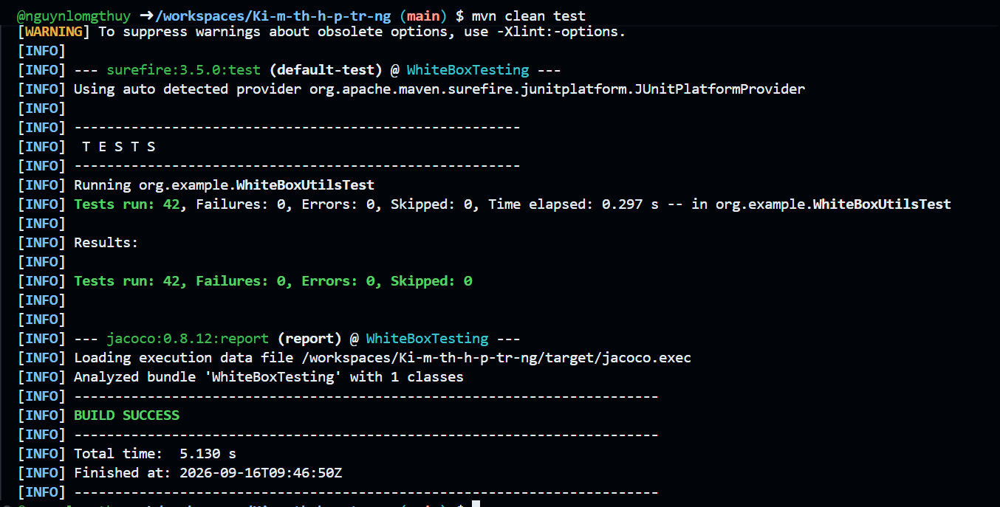
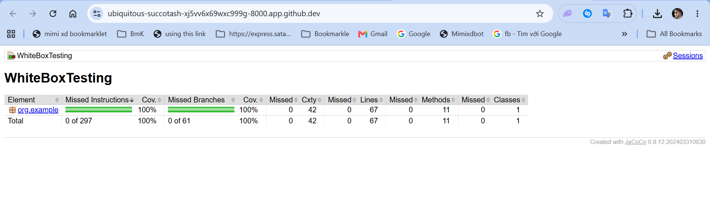

# Bài thực hành: Kiểm thử hộp trắng

## 1. Giới thiệu

Bài thực hành kiểm thử hộp trắng sử dụng Java, JUnit 5 và JaCoCo.

## 2. Các chức năng

Chương trình gồm 8 chức năng:

1. Tính chu vi hình chữ nhật
2. Tính diện tích hình chữ nhật
3. Giải phương trình bậc 2
4. Tính số ngày của một tháng
5. Kiểm tra số nguyên tố
6. Tính S = 1 - 2 + 3 - 4 + ... +/- n
7. Tính UCLN của a và b
8. Tính S = 1! + 2! + ... + n!

## 3. Công nghệ sử dụng

- Java
- Maven
- JUnit 5
- JaCoCo
- GitHub Codespaces

## 4. Kiểm thử hộp trắng

Các test case kiểm tra:

- Câu lệnh
- Nhánh điều kiện
- Vòng lặp
- Đường đi logic
- Giá trị biên
- Ngoại lệ

## 5. Chạy JUnit

```bash
mvn clean test

## Kết quả kiểm thử

### JUnit



### JaCoCo Coverage



Kết quả:

- 100% Statement / Instruction Coverage
- 100% Branch Coverage
- Tất cả test case đều chạy thành công

## Danh sách Test Case

Danh sách chi tiết các trường hợp kiểm thử:

[TEST_CASES.md](TEST_CASES.md)

## Log kết quả JUnit

Kết quả chạy JUnit:

[junit-result.txt](junit-result.txt)